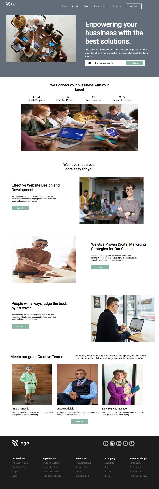

# Assignment 1

## Project 12 [Live Link](https://nachiketkeripaleproject12.netlify.app/)

- Build this project from strach.
- Used Flex and Positions propertys in this project.
- Used Margin and Padding propertys in this projects
- Learnt to align multiple section.
- Used svg files.
- Used Goolge Fonts for this project.

---

## Time taken to finish this project

-   6 hour to complete it.

#### Screenshot

 

